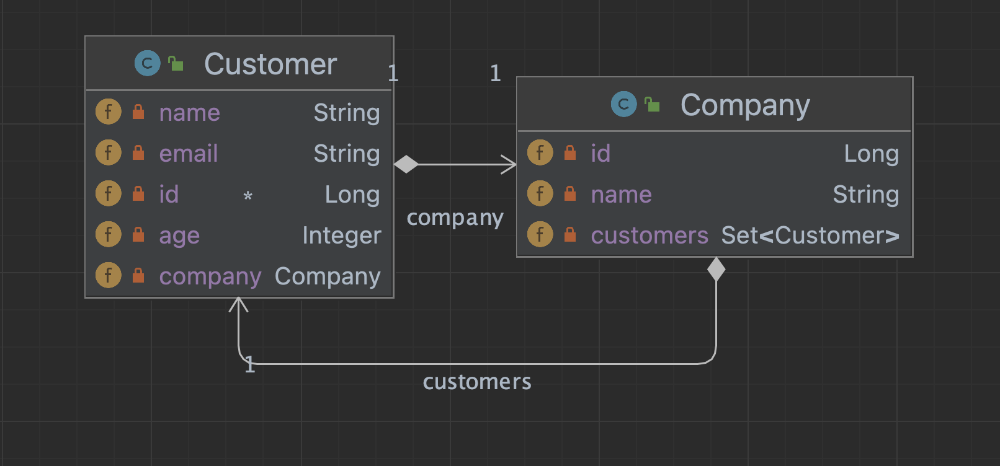
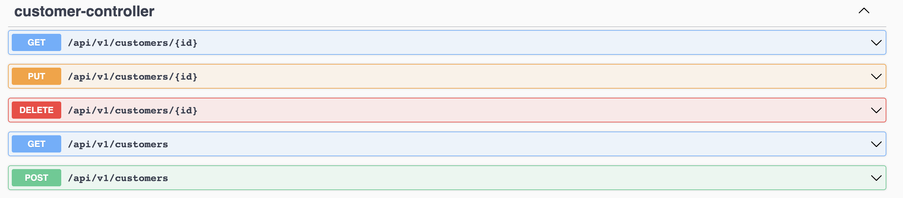

# SpringBootTls

Пример Java приложения, которое принимает http-запросы. Предоставлен Docker для запуска приложения. Передача запросов осуществляется по TLS (сертификат самоподписанный).
<br>

Используемый стэк: Spring Boot, Spring MVC, Spring Data JPA

## Как запустить

Подготовлен bash-скрипт для запуска приложения в Docker.
 - Собирается jar
 - jar копируется в директорию с docker file
 - Запускается команда docker-compose up
```bash
$ sh docker_run.sh
```

## Описание приложения
В БД имеются сущности Customer и Company.

Приложение предоставляет endpoints для совершения CRUD операций с сущностью Customer.

